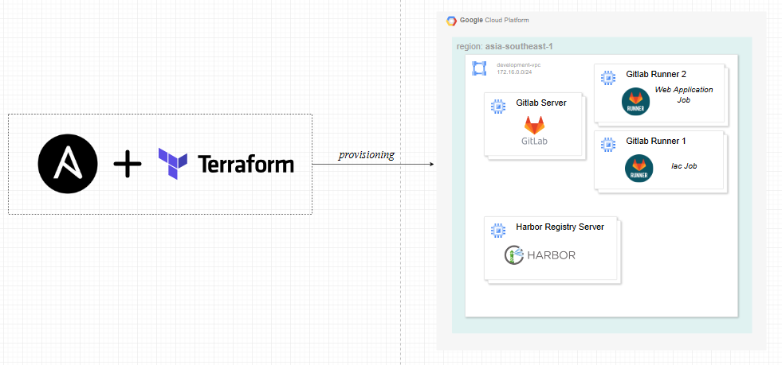
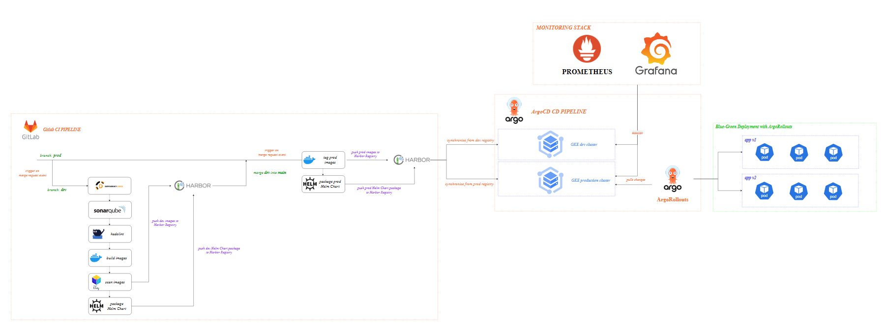
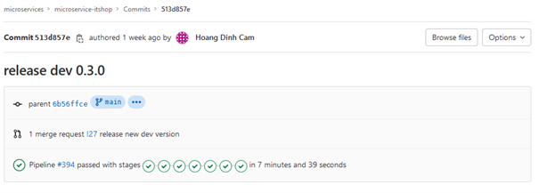
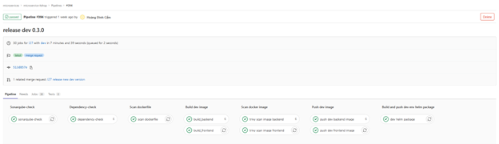
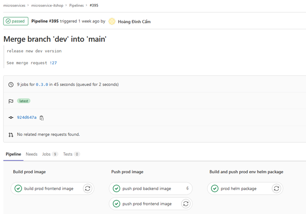
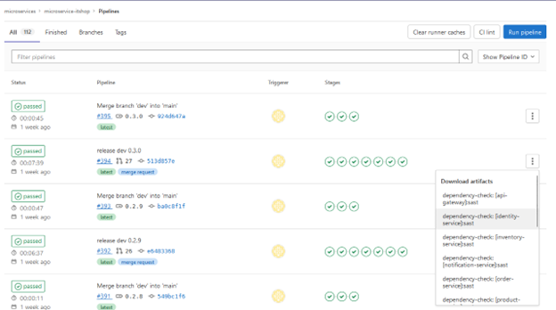
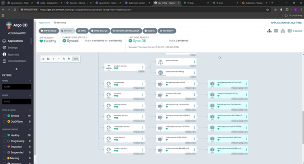
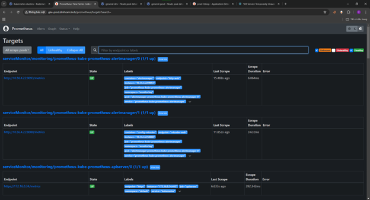
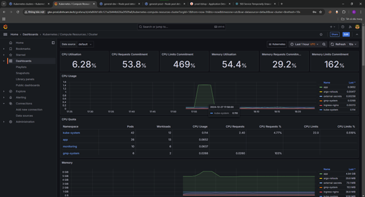
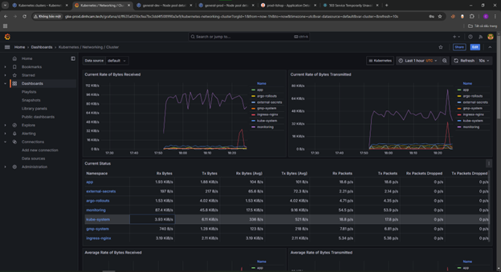

# Microservice IT Shop

Welcome to the **Microservice IT Shop** project! This repository contains the codebase and configuration for a microservice-based IT shop platform. All infrastructure and services are designed to run on **Google Cloud Platform (GCP)**, with a focus on secure, scalable, and efficient development and deployment workflows.

## Table of Contents

- [Microservice IT Shop](#microservice-it-shop)
  - [Table of Contents](#table-of-contents)
  - [Overview](#overview)
  - [Infrastructure](#infrastructure)
  - [Overall CICD Workflow](#overall-cicd-workflow)
  - [Continuous Integration (CI)](#continuous-integration-ci)
  - [Continuous Deployment (CD)](#continuous-deployment-cd)
  - [Monitoring](#monitoring)
  - [Project Implementation](#project-implementation)
    - [CI Pipeline on Dev Branch](#ci-pipeline-on-dev-branch)
    - [CI Pipeline on Prod Branch](#ci-pipeline-on-prod-branch)
    - [CD for Dev Environment](#cd-for-dev-environment)
    - [CD for Prod Environment](#cd-for-prod-environment)
    - [Prometheus Metrics](#prometheus-metrics)
    - [Grafana Dashboard](#grafana-dashboard)
  - [Getting Started](#getting-started)
  - [Contributing](#contributing)
  - [Author](#author)

## Overview

This project leverages modern DevOps tools and practices to ensure reliable and secure software delivery. Below is an overview of the technologies and tools used:

- **Infrastructure**: Hosted on **Google Cloud Platform (GCP)**.
- **Version Control**: Self-hosted **GitLab Server**.
- **Container Registry**: Self-hosted **Harbor Registry**.
- **CI/CD Pipelines**: Managed with **GitLab CI/CD**.
- **Security Tools**:
  - Dependency check with **OWASP Dependency-Check**.
  - Dockerfile scanning with **Hadolint**.
  - Code scanning with **SonarQube**.
  - Image scanning with **Trivy**.
- **Deployment**:
  - Continuous Deployment with **ArgoCD**.
  - Blue-Green Deployment strategy with **Argo Rollouts**.
- **Monitoring**: Metrics and visualization with **Prometheus** and **Grafana**.

## Infrastructure

The infrastructure for this project is deployed entirely on **Google Cloud Platform (GCP)** and includes the following components with two main environments:

**Development Environment**:
  - **GitLab Server**: Self-hosted version control system for managing the codebase and CI/CD pipelines.
  - **GitLab Runner**: Self-hosted runners for executing CI/CD jobs.
  - **Harbor Registry**: Self-hosted registry for managing Docker images and Helm packages.

**Operation Environment**:
The operation environment for running and managing the system includes:
- **Google Kubernetes Engine (GKE)**: Managed Kubernetes clusters for deploying and running microservices.
- **Supporting Components**:
  - Configuration and provisioning of GKE clusters using **Terraform** (HCL).
  - Automation scripts written in **PowerShell** for operational tasks and cluster management.

## Overall CICD Workflow

## Continuous Integration (CI)

The CI pipeline is designed to ensure code quality, security, and best practices. The following tools are integrated into the CI process:

- **OWASP Dependency-Check**: Scans project dependencies for known vulnerabilities.
- **Hadolint**: Lints and scans Dockerfiles to ensure best practices and security.
- **SonarQube**: Performs static code analysis to identify code quality issues.
- **Trivy**: Scans Docker images for vulnerabilities.

## Continuous Deployment (CD)

The project uses **ArgoCD** for automated Continuous Deployment, ensuring fast and reliable delivery of updates. Deployment strategies include:

- **Blue-Green Deployment**: Managed with **Argo Rollouts** for seamless transitions between application versions with minimal downtime.

## Monitoring

Monitoring and observability are achieved through the following tools:

- **Prometheus**: Collects and stores metrics from applications and infrastructure.
- **Grafana**: Visualizes metrics and provides dashboards for easy monitoring.

## Project Implementation

This section is reserved for showcasing images and screenshots of the system's implementation. Below you can add relevant visuals to highlight system components, workflows, or dashboards.

### CI Pipeline on Dev Branch

### CI Pipeline on Prod Branch

### CD for Dev Environment

### CD for Prod Environment

### Prometheus Metrics

### Grafana Dashboard

## Getting Started

To get started with this project, follow the installation and deployment instructions in the repository's main documentation.

## Contributing

We welcome contributions! Please follow the repository's guidelines for submitting issues, bug fixes, or new features.

## Author

Created by **@dinhcam89** 🚀.
