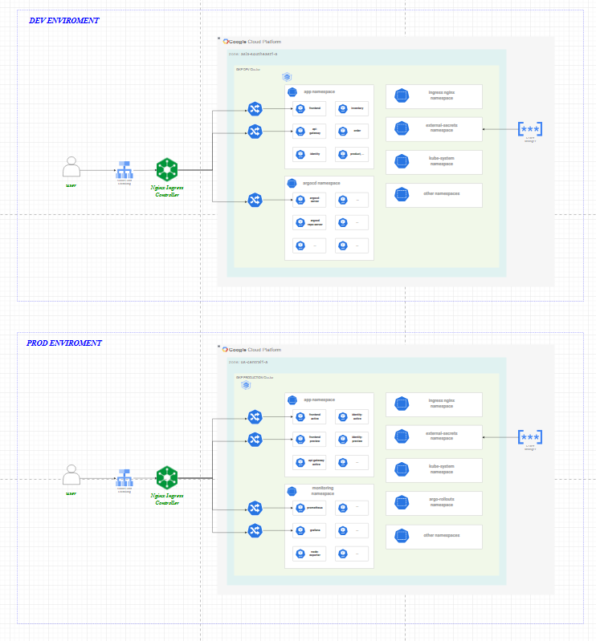

# Microservice IT Shop

Welcome to the **Microservice IT Shop** project! This repository contains the codebase and configuration for a microservice-based IT shop platform. All infrastructure and services are designed to run on **Google Cloud Platform (GCP)**, with a focus on secure, scalable, and efficient development and deployment workflows.

## Table of Contents

- [Overview](#overview)
- [Infrastructure](#infrastructure)
- [Continuous Integration (CI)](#continuous-integration-ci)
- [Continuous Deployment (CD)](#continuous-deployment-cd)
- [Monitoring](#monitoring)
- [Getting Started](#getting-started)
- [Contributing](#contributing)
- [License](#license)

## Overview

This project leverages modern DevOps tools and practices to ensure reliable and secure software delivery. Below is an overview of the technologies and tools used:

- **Infrastructure**: Hosted on **Google Cloud Platform (GCP)**
- **Version Control**: Self-hosted **GitLab Server**
- **Container Registry**: Self-hosted **Harbor Registry**
- **CI/CD Pipelines**: Managed with **GitLab CI/CD**
- **Security Tools**:
  - Dependency check with **OWASP Dependency-Check**
  - Dockerfile scanning with **Hadolint**
  - Code scanning with **SonarQube**
  - Image scanning with **Trivy**
- **Deployment**:
  - Continuous Deployment with **ArgoCD**
  - Blue-Green Deployment strategy with **Argo Rollouts**
- **Monitoring**: Metrics and visualization with **Prometheus** and **Grafana**

## Infrastructure

The infrastructure for this project is deployed entirely on **Google Cloud Platform (GCP)** and includes the following components:

- **GitLab Server**: Self-hosted version control system for managing the codebase and CI/CD pipelines.
- **GitLab Runner**: Self-hosted runners for executing CI/CD jobs.
- **Harbor Registry**: Self-hosted registry for managing Docker images and Helm packages.

## Continuous Integration (CI)

The CI pipeline is designed to ensure code quality, security, and best practices. The following tools are integrated into the CI process:

- **OWASP Dependency-Check**: Scans project dependencies for known vulnerabilities.
- **Hadolint**: Lints and scans Dockerfiles to ensure best practices and security.
- **SonarQube**: Performs static code analysis to identify code quality issues.
- **Trivy**: Scans Docker images for vulnerabilities.

## Continuous Deployment (CD)

The project uses **ArgoCD** for automated Continuous Deployment, ensuring fast and reliable delivery of updates. Deployment strategies include:

- **Blue-Green Deployment**: Managed with **Argo Rollouts** for seamless transitions between application versions with minimal downtime.

## Monitoring

Monitoring and observability are achieved through the following tools:

- **Prometheus**: Collects and stores metrics from applications and infrastructure.
- **Grafana**: Visualizes metrics and provides dashboards for easy monitoring.

## Getting Started

### Prerequisites

To get started, ensure you have the following installed locally:

- **Git**: Version control system
- **Docker**: For containerization
- **Helm**: Kubernetes package manager
- **Kubectl**: Kubernetes command-line tool

### Steps

1. Clone this repository:
   ```bash
   git clone https://gitlab.example.com/your-repo-path.git
   cd microservice-itshop
   ```

2. Build and run the application using Docker:
   ```bash
   docker build -t microservice-itshop .
   docker run -p 8080:8080 microservice-itshop
   ```

3. Deploy the application using Helm:
   ```bash
   helm install microservice-itshop ./helm-chart
   ```

4. Monitor the application using Grafana dashboards.

## Contributing

We welcome contributions! Please follow the [contribution guidelines](CONTRIBUTING.md) for submitting issues, bug fixes, or new features.

## License

This project is licensed under the MIT License. See the [LICENSE](LICENSE) file for more details.
